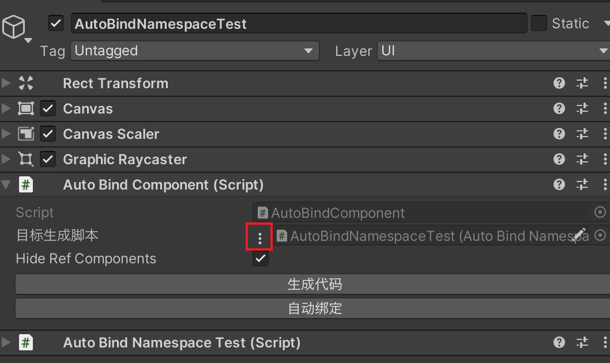
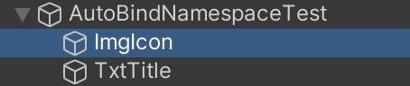
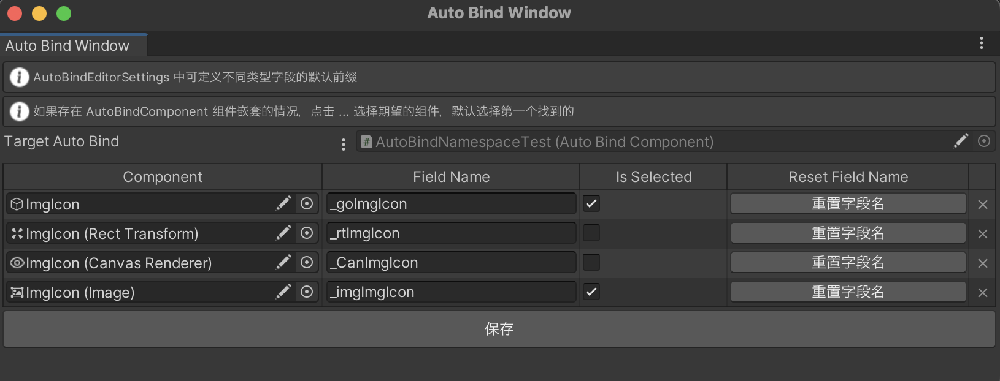
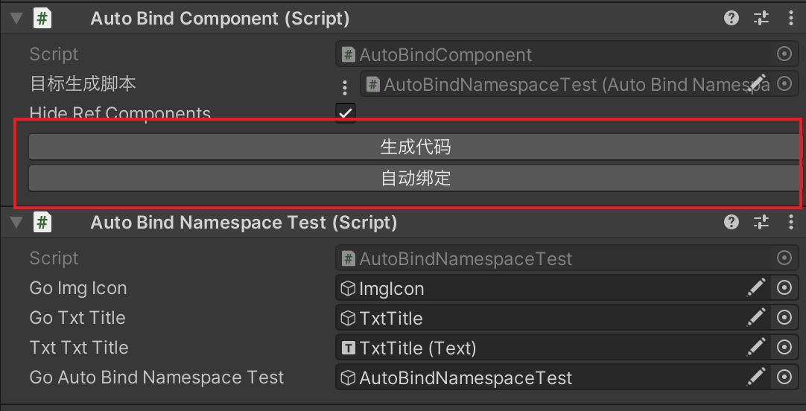

# Unity-AutoBindComponent
Unity 自动绑定组件, 依赖 Odin 插件 (可以是 EditorOnlyMode)。

## 插件导入

## 使用方式
1. 点击 MenuItem : `Project/AutoBindComponent/Create EditorSettings` 创建配置文件，
该文件可以放在任意位置，只在 Editor 下使用。

2. 创建需要绑定的组件的脚本，并设置为 partial，例如：
```csharp
using UnityEngine;

namespace AutoBindNamespace
{
    public partial class AutoBindNamespaceTest : MonoBehaviour
    {
    }
}
```

3. 在目标对象上挂载 AutoBindComponent 脚本和刚才创建的目标脚本，并在 AutoBindComponent 组件上点击三个点选择脚本。


4. 选中要引用的子对象，右键点击 "自动绑定窗口"，或者使用 "Shift + A" 快捷键打开自动绑定窗口。



选中需要引用的组件，点击保存后，在 Hierarchy 视图中会出现一个标识，标识该对象被引用了。


5. 点击 AutoBindComponent 组件上的 "生成代码" 按钮，将在目标脚本的同级目录下创建一个新的脚本，代码如下:
```csharp
// *********************************************************
// Automatically generated by the tool, please do not modify
// *********************************************************

using UnityEngine;
using UnityEngine.UI;


namespace AutoBindNamespace
{
    public partial class AutoBindNamespaceTest
    {
        [SerializeField] private GameObject _goImgIcon;
        [SerializeField] private GameObject _goTxtTitle;
        [SerializeField] private Text _txtTxtTitle;
        [SerializeField] private GameObject _goAutoBindNamespaceTest;
    }
}

```

6. 点击 AutoBindComponent 组件上的 "自动绑定" 按钮，将自动引用需要的脚本。
